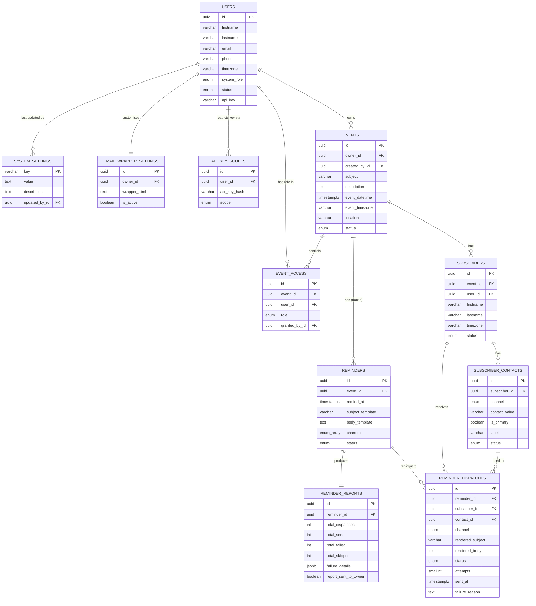

# **REMINDER MANAGEMENT SYSTEM**

Functional Specification

Version 1.0

**Status: Final — Ready for Development**

April 2026

## **Table of Contents**

## **1. Purpose & Scope**

### **1.1 Overview**

The Reminder Management System (RMS) is a reminder-centred platform that enables registered users and integrated third-party systems to configure, manage, and dispatch personalised multi-channel reminder notifications for any type of schedulable event.

The system is deliberately reminder-centred rather than event-centred. An event provides context; the reminder is the deliverable. This distinction drives every architectural decision: reminders are first-class entities with their own lifecycle, delivery audit trail, and reporting. The dispatch engine — the component that queries for due reminders and fires them — is the heart of the system.

### **1.2 In Scope — Version 1**

* User account management via API and web UI
* Event and reminder configuration via API and web UI
* Per-event subscriber management via API and web UI
* Per-event role-based access control (owner, contributor, reader)
* Multi-channel delivery: HTML email and SMS, sent simultaneously
* Extensible channel architecture for future delivery channels
* Configurable dispatch engine with poll frequency adjustable at runtime without redeployment
* Per-reminder dispatch reports with automated owner notification
* JWT authentication for web UI sessions
* API key authentication for machine-to-machine integrations, with optional scope restrictions
* Public registration with system-admin-controlled enable/disable gate
* Email verification flow for self-registered users
* Custom HTML email wrapper branding per user
* API rate limiting with documented Redis migration path
* Automated event archiving with archived events remaining queryable

### **1.3 Out of Scope — Version 1**

* Recurring or repeating events
* Mobile push notifications
* Webhook delivery channel
* Self-service subscriber unsubscribe portal
* Billing, usage tiers, or multi-tenant isolation
* Real-time notifications or websocket connections

## **2. Stakeholders, Roles & Permissions**

### **2.1 System-Level Roles**

Every authenticated account has a system-level role that governs platform-wide capabilities.

| **Role** | **Description** | **Assigned by** |
| --- | --- | --- |
| system\_admin | Full platform access. Can manage all users, all events, all settings. Can enable/disable public registration, adjust system settings, and un-archive events. | Seeded at deployment or promoted by another admin |
| user | Standard account. Can create events, manage their own profile, and interact with events they have been granted access to. | Default on registration or admin creation |

### **2.2 Event-Level Access Control**

In addition to their system role, every user has a role on each individual event they can access. This is stored in the event\_access table and allows fine-grained control without affecting their system-level role.

| **Event Role** | **View event** | **Edit fields** | **Add/edit reminders** | **Delete event** | **Manage subscribers** | **Manage access grants** | **Reassign owner** |
| --- | --- | --- | --- | --- | --- | --- | --- |
| owner | Yes | Yes | Yes | Yes | Yes | Yes | Yes |
| contributor | Yes | Yes | Yes | No | Yes | No | No |
| reader | Yes | No | No | No | No | No | No |

|  |
| --- |
| *The user who creates an event is automatically assigned the owner role. A system\_admin has implicit owner-level access on all events. An event must always have exactly one owner. API key integrations act with owner-level access for events they create.* |

### **2.3 Stakeholder Types**

| **Stakeholder** | **Description** |
| --- | --- |
| System User | A registered, verified account. Creates and manages events via the web UI or API. |
| Event Owner | The system user responsible for a specific event. Defaults to the creator. Can be reassigned. |
| Subscriber | A person to be notified. May or may not be a system user. Defined by name, timezone, and one or more contact details (email/phone). |
| External System | A third-party application integrating via the REST API using an API key. Operates with owner-level permissions for events it creates. |
| System Admin | Platform operator with full access and the ability to configure system-wide settings. |

## **3. Core Entities**

## **3.0 Entity Relationship Diagram**

Renderers that support Mermaid will display the diagram below. If your renderer does not support Mermaid, open the original HTML at [rms_erd_v03.html](rms_erd_v03.html#L1).

### **3.1 Entity Summary**

| **Entity** | **Table** | **Purpose** |
| --- | --- | --- |
| User | users | Registered account holder. Owns events and API keys. |
| Email Verification Token | email\_verification\_tokens | Time-limited token to verify a self-registered user's email address. |
| API Key | api\_keys | Named authentication credential for machine-to-machine access. |
| API Key Scope | api\_key\_scopes | Optional permission restriction applied to an API key. |
| System Setting | system\_settings | Key/value store for platform-wide configuration including dispatch poll interval. |
| Email Wrapper Setting | email\_wrapper\_settings | Per-user custom HTML wrapper applied to outgoing reminder emails. |
| Event | events | The schedulable occurrence providing context for reminders. |
| Event Access | event\_access | Per-user role grant for a specific event. |
| Subscriber | subscribers | A named delivery target scoped to one event. |
| Subscriber Contact | subscriber\_contacts | Individual contact detail (email or phone) for a subscriber. |
| Reminder | reminders | A scheduled notification: when to send, what to say, which channels to use. |
| Reminder Dispatch | reminder\_dispatches | Atomic delivery record: one per Reminder x Subscriber x Channel. |
| Reminder Report | reminder\_reports | Aggregated delivery summary produced after all dispatches for a reminder resolve. |

### **3.2 Entity Details**

#### **3.2.1 users**

| **Field** | **Type** | **Constraints / Notes** |
| --- | --- | --- |
| id | UUID | PK, system-generated |
| firstname | varchar(100) | Required |
| lastname | varchar(100) | Required |
| email | varchar(255) | Required, unique, valid format. Indexed. |
| phone | varchar(30) | Optional |
| password\_hash | varchar | Required. bcrypt hash. |
| timezone | varchar(60) | IANA timezone string. Default: UTC. Used as fallback for subscriber timezone resolution. |
| system\_role | enum | user | system\_admin. Default: user. |
| status | enum | active | disabled | deleted. Soft-delete only. |
| email\_verified | boolean | Default false for self-registered users. Default true for admin-created users. |
| email\_verified\_at | timestamptz | Nullable. Set when verification completes. |
| created\_at | timestamptz | System-set |
| updated\_at | timestamptz | System-set |

**Business rules:**

* Disabling a user invalidates all their active API keys immediately. Their events remain active and reminders continue to fire.
* Deletion is a soft-delete (status = deleted). Hard deletion is not permitted. Data is retained for audit purposes.
* A user being deleted must have their events reassigned before deletion completes.

#### **3.2.2 email\_verification\_tokens**

| **Field** | **Type** | **Constraints / Notes** |
| --- | --- | --- |
| id | UUID | PK |
| user\_id | UUID FK | References users.id |
| token\_hash | varchar(128) | SHA-256 hash of the raw token. Unique. |
| expires\_at | timestamptz | created\_at + 24 hours |
| used\_at | timestamptz | Nullable. Set when token is consumed. |
| created\_at | timestamptz | System-set |

#### **3.2.3 api\_keys**

| **Field** | **Type** | **Constraints / Notes** |
| --- | --- | --- |
| id | UUID | PK |
| user\_id | UUID FK | References users.id |
| key\_hash | varchar(128) | SHA-256 hash of the raw key. Unique. Hot-path lookup index. |
| key\_prefix | varchar(8) | First 8 chars of raw key stored plaintext for display. e.g. rms\_a1b2 |
| name | varchar(100) | Required. Human label. e.g. "CRM integration" |
| status | enum | active | revoked |
| last\_used\_at | timestamptz | Nullable. Updated asynchronously on each authenticated request. |
| expires\_at | timestamptz | Optional. Null = no expiry. |
| created\_at | timestamptz | System-set |
| revoked\_at | timestamptz | Nullable. Set when status changes to revoked. |

*Key format: rms\_{32 random URL-safe characters}. Maximum 10 active keys per user. The raw key is shown exactly once at creation and never stored.*

#### **3.2.4 api\_key\_scopes**

| **Field** | **Type** | **Constraints / Notes** |
| --- | --- | --- |
| id | UUID | PK |
| api\_key\_id | UUID FK | References api\_keys.id |
| scope | enum | users:read | events:read | events:write | subscribers:read | subscribers:write | reports:read |
| created\_at | timestamptz | System-set |

*A key with no scope records has unrestricted access (equivalent to the owning user's permissions). Unique constraint on (api\_key\_id, scope).*

#### **3.2.5 system\_settings**

| **Key** | **Default** | **Description** |
| --- | --- | --- |
| allow\_public\_registration | false | When false, POST /auth/register returns 403. Toggle to open registration. |
| dispatch\_poll\_interval\_seconds | 60 | How often the dispatch engine polls for due reminders. Min: 10, Max: 3600. Read by the engine on every loop iteration — changes take effect within one cycle, no restart required. |
| dispatch\_lookahead\_seconds | 65 | Reminders due within this window are picked up each poll cycle. Should be slightly larger than poll interval. |
| dispatch\_retry\_max | 3 | Maximum delivery attempts per dispatch record before marking as permanently failed. |
| dispatch\_retry\_backoff\_minutes | 1,5,15 | Comma-separated backoff intervals in minutes between retry attempts. |
| event\_archive\_days | 90 | Days after event\_datetime before the nightly job auto-archives an event. |
| default\_email\_wrapper\_html | (system HTML) | The fallback email wrapper used when a user has no custom wrapper set. |

|  |
| --- |
| *dispatch\_poll\_interval\_seconds is the key addition for runtime configurability. The dispatch engine reads this from the database at the start of every loop — a system\_admin updating this value via PATCH /admin/settings/dispatch\_poll\_interval\_seconds takes effect within one poll cycle with no application restart.* |

#### **3.2.6 email\_wrapper\_settings**

| **Field** | **Type** | **Constraints / Notes** |
| --- | --- | --- |
| id | UUID | PK |
| owner\_id | UUID FK | References users.id. Unique — one record per user. |
| wrapper\_html | text | Required. Full HTML document with exactly one {{body}} injection point. |
| is\_active | boolean | Default true. When false, system default wrapper is used. |
| created\_at | timestamptz | System-set |
| updated\_at | timestamptz | System-set |

*The API validates that wrapper\_html contains exactly one {{body}} placeholder. Missing or multiple {{body}} placeholders return 422. No other template variables are permitted in the wrapper itself.*

#### **3.2.7 events**

| **Field** | **Type** | **Constraints / Notes** |
| --- | --- | --- |
| id | UUID | PK |
| owner\_id | UUID FK | References users.id. Required. Can be reassigned. |
| created\_by\_id | UUID FK | References users.id. Set at creation, immutable. |
| subject | varchar(255) | Required |
| description | text | Optional |
| event\_datetime | timestamptz | Required. Stored in UTC. |
| event\_timezone | varchar(60) | IANA string. Captures the originating timezone for display purposes. |
| location | varchar(500) | Optional |
| status | enum | active | cancelled | archived |
| created\_at | timestamptz | System-set |
| updated\_at | timestamptz | System-set |

**Business rules:**

* An event must have at least one active subscriber before any reminder is dispatched.
* Cancelling an event transitions all scheduled reminders to cancelled, suppressing all further dispatch.
* Archiving is triggered automatically by a nightly job for events where event\_datetime is more than event\_archive\_days days in the past.
* Archived events are read-only via the API. All mutation operations return 409 EVENT\_ARCHIVED.
* Hard deletion is blocked if any reminder\_dispatch records exist for the event.

#### **3.2.8 event\_access**

| **Field** | **Type** | **Constraints / Notes** |
| --- | --- | --- |
| id | UUID | PK |
| event\_id | UUID FK | References events.id |
| user\_id | UUID FK | References users.id |
| role | enum | owner | contributor | reader |
| granted\_by\_id | UUID FK | References users.id |
| created\_at | timestamptz | System-set |

*Unique constraint on (event\_id, user\_id). An event must always have exactly one owner role grant.*

#### **3.2.9 subscribers**

| **Field** | **Type** | **Constraints / Notes** |
| --- | --- | --- |
| id | UUID | PK |
| event\_id | UUID FK | References events.id |
| user\_id | UUID FK | Optional. Links to a system user if the subscriber is also a registered user. |
| firstname | varchar(100) | Required |
| lastname | varchar(100) | Required |
| timezone | varchar(60) | Optional (nullable). IANA string. Resolution order: subscriber timezone → event owner timezone → UTC. |
| status | enum | active | unsubscribed |
| created\_at | timestamptz | System-set |
| updated\_at | timestamptz | System-set |

**Business rules:**

* A subscriber is scoped to a specific event. The same real-world person subscribing to two events is two separate records.
* An event must have at least one active subscriber at all times. Removing the last active subscriber is rejected with 409 LAST\_SUBSCRIBER.
* At least one active subscriber\_contact record must exist per subscriber. Enforced on create and update.
* When subscriber timezone is null, the event owner's timezone is used. This fallback is noted in the {{event\_timezone\_label}} template variable output so the subscriber is aware.

#### **3.2.10 subscriber\_contacts**

| **Field** | **Type** | **Constraints / Notes** |
| --- | --- | --- |
| id | UUID | PK |
| subscriber\_id | UUID FK | References subscribers.id |
| channel | enum | email | sms. Extensible: new channel types require only a new enum value and a delivery adapter. |
| contact\_value | varchar(320) | Required. Email address or E.164 phone number. |
| is\_primary | boolean | Default false. Exactly one primary per channel per subscriber. Enforced at application layer. |
| label | varchar(100) | Optional. e.g. "work email", "mobile" |
| status | enum | active | inactive |
| created\_at | timestamptz | System-set |

#### **3.2.11 reminders**

| **Field** | **Type** | **Constraints / Notes** |
| --- | --- | --- |
| id | UUID | PK |
| event\_id | UUID FK | References events.id |
| remind\_at | timestamptz | Required. UTC. Must be before event.event\_datetime and at least 5 minutes in the future at creation time. |
| subject\_template | varchar(500) | Required. Used as the email subject. Supports {{variables}}. |
| body\_template | text | Required. HTML body for email. Plain text (HTML stripped) used for SMS. Supports {{variables}}. |
| channels | enum[] | Array. At least one of: email, sms. All specified channels are sent simultaneously. |
| status | enum | scheduled | processing | sent | cancelled | failed |
| created\_at | timestamptz | System-set |
| updated\_at | timestamptz | System-set |

**Business rules:**

* Maximum 5 reminders per event. Enforced at creation.
* A reminder in sent or cancelled status is immutable.
* Deleting a reminder with existing dispatch records is blocked — cancel instead.
* All {{variable}} tokens in subject\_template and body\_template are validated at creation/update time. Unknown variables return 422 INVALID\_TEMPLATE\_VARIABLES.

#### **3.2.12 Template Variable Reference**

All templates use {{variable\_name}} syntax. Values are substituted per-subscriber at dispatch time using the resolved subscriber timezone.

| **Variable** | **Resolves to** | **Notes** |
| --- | --- | --- |
| {{subscriber\_firstname}} | Subscriber's first name |  |
| {{subscriber\_lastname}} | Subscriber's last name |  |
| {{subscriber\_fullname}} | First + last name |  |
| {{event\_subject}} | Event subject |  |
| {{event\_description}} | Event description | Empty string if not set |
| {{event\_datetime}} | Event date and time | Formatted in resolved subscriber timezone |
| {{event\_date}} | Event date only | Formatted in resolved subscriber timezone |
| {{event\_time}} | Event time only | Formatted in resolved subscriber timezone |
| {{event\_location}} | Event location | "TBD" if not set |
| {{event\_timezone\_label}} | Timezone name and abbreviation | e.g. "Europe/Madrid (CET)". Appended with "[owner's timezone]" note if fallback was used. |
| {{owner\_firstname}} | Event owner's first name |  |
| {{owner\_lastname}} | Event owner's last name |  |
| {{owner\_fullname}} | Event owner's full name |  |
| {{reminder\_datetime}} | When this reminder fires | In resolved subscriber timezone |

#### **3.2.13 reminder\_dispatches**

| **Field** | **Type** | **Constraints / Notes** |
| --- | --- | --- |
| id | UUID | PK |
| reminder\_id | UUID FK | References reminders.id |
| subscriber\_id | UUID FK | References subscribers.id |
| subscriber\_contact\_id | UUID FK | References subscriber\_contacts.id. The specific contact used. |
| channel | enum | email | sms |
| rendered\_subject | varchar(500) | Email subject after template substitution. Null for SMS. |
| rendered\_body | text | Message body after template substitution. |
| status | enum | pending | sent | failed | skipped |
| attempts | smallint | Default 0. Max 3. |
| last\_attempted\_at | timestamptz | Nullable |
| sent\_at | timestamptz | Nullable. Set on success. |
| failure\_reason | text | Nullable. Set on failure. |
| created\_at | timestamptz | System-set |

#### **3.2.14 reminder\_reports**

| **Field** | **Type** | **Constraints / Notes** |
| --- | --- | --- |
| id | UUID | PK |
| reminder\_id | UUID FK | References reminders.id. Unique — one report per reminder. |
| total\_dispatches | int | Total dispatch records created |
| total\_sent | int | Successfully delivered |
| total\_failed | int | Failed after all retry attempts |
| total\_skipped | int | Skipped (no contact for channel, subscriber unsubscribed, etc.) |
| failure\_details | jsonb | Array of {subscriber\_id, channel, contact\_value, reason} |
| report\_sent\_to\_owner | boolean | Whether the owner summary email was sent |
| report\_sent\_at | timestamptz | Nullable |
| created\_at | timestamptz | System-set |

### **3.3 Database Indexing Strategy**

All indexes are created in the initial migration files. They are specified here to ensure correct schema from day one.

| **Table** | **Index name** | **Columns** | **Type** | **Reason** |
| --- | --- | --- | --- | --- |
| users | users\_email\_idx | email | UNIQUE btree | Login lookup |
| users | users\_status\_idx | status | btree | Filter active users |
| api\_keys | api\_keys\_hash\_idx | key\_hash | UNIQUE btree | Hot path: every API request |
| api\_keys | api\_keys\_user\_id\_idx | user\_id | btree | List keys per user |
| events | events\_owner\_id\_idx | owner\_id | btree | List events by owner |
| events | events\_status\_dt\_idx | status, event\_datetime | btree | Archive job; date-range queries |
| event\_access | event\_access\_uq | event\_id, user\_id | UNIQUE btree | Access check per request |
| event\_access | event\_access\_user\_idx | user\_id | btree | Events accessible by user |
| subscribers | sub\_event\_id\_idx | event\_id | btree | List subscribers for event |
| subscribers | sub\_event\_status\_idx | event\_id, status | btree | Last-subscriber guard |
| subscriber\_contacts | sc\_subscriber\_idx | subscriber\_id | btree | Load contacts for subscriber |
| subscriber\_contacts | sc\_primary\_idx | subscriber\_id, channel, is\_primary | btree | Fan-out: primary contact per channel |
| reminders | rem\_event\_id\_idx | event\_id | btree | List reminders for event |
| reminders | rem\_scheduler\_idx | status, remind\_at | btree | HOT PATH: 60-second scheduler poll |
| reminder\_dispatches | rd\_reminder\_id\_idx | reminder\_id | btree | Load dispatches for reminder |
| reminder\_dispatches | rd\_retry\_idx | status, attempts, last\_attempted\_at | btree | Retry worker query |
| reminder\_dispatches | rd\_pending\_idx | reminder\_id, status | btree | All-resolved check for report trigger |
| reminder\_dispatches | rd\_sent\_at\_idx | sent\_at | btree | Archive/cleanup queries |
| reminder\_reports | rr\_reminder\_uq | reminder\_id | UNIQUE btree | One report per reminder |
| email\_wrapper\_settings | ews\_owner\_uq | owner\_id | UNIQUE btree | One wrapper per user |

## **4. API Specification**

### **4.1 Overview**

All endpoints are prefixed /api/v1. The API is JSON-only. All datetimes are ISO 8601 with UTC offset.

### **4.2 Authentication**

| **Mode** | **Header** | **Use case** | **Expiry** |
| --- | --- | --- | --- |
| JWT | Authorization: Bearer <token> | Web UI sessions. Issued on login. | 24 hours. Refreshable. |
| API Key | X-Api-Key: <key> | Machine-to-machine. External integrations. | Optional. None by default. |

### **4.3 Rate Limiting**

| **Tier** | **Window** | **Limit** | **Applied to** |
| --- | --- | --- | --- |
| Unauthenticated | 15 min | 100 requests | IP address |
| Authenticated user | 1 min | 300 requests | user.id |
| Authenticated API key | 1 min | 600 requests | API key |
| system\_admin | 1 min | 1000 requests | user.id |
| Auth endpoints (/auth/\*) | 15 min | 20 attempts | IP — brute-force protection |
| Resend verification | 1 hour | 3 per email | Email address |

Response headers on every request: X-RateLimit-Limit, X-RateLimit-Remaining, X-RateLimit-Reset.

Exceeded limits return 429 Too Many Requests with a Retry-After header and a retry\_after timestamp in the response body.

*Implementation: express-rate-limit with in-memory store for v1. Migration path: replace store with rate-limit-redis for multi-instance deployment. No rate limit logic changes required.*

### **4.4 Standard Response Envelope**

{ "success": true, "data": { ... }, "meta": { "page": 1, "per\_page": 20, "total": 150 }, "error": null }

On error:

{ "success": false, "data": null, "error": { "code": "VALIDATION\_ERROR", "message": "...", "details": [...] } }

### **4.5 Endpoint Reference**

#### **4.5.1 Authentication Endpoints**

| **Method** | **Path** | **Access** | **Description** |
| --- | --- | --- | --- |
| **POST** | /auth/register | Public (gated by allow\_public\_registration) | Self-registration. Returns 403 if registration is disabled. |
| **GET** | /auth/verify-email?token=... | Public | Consume email verification token. Browser-friendly. |
| **POST** | /auth/resend-verification | Public (rate limited) | Resend verification email. Never reveals whether email exists. |
| **POST** | /auth/login | Public | Exchange credentials for JWT. Returns 403 EMAIL\_NOT\_VERIFIED if unverified. |
| **POST** | /auth/refresh | Authenticated | Refresh JWT token |
| **POST** | /auth/logout | Authenticated | Invalidate JWT |

#### **4.5.2 User Endpoints**

| **Method** | **Path** | **Access** | **Description** |
| --- | --- | --- | --- |
| **POST** | /users | system\_admin | Create user (admin). Pre-verified, immediately active. |
| **GET** | /users/:id | Self / system\_admin | Get user profile |
| **PATCH** | /users/:id | Self / system\_admin | Update name, email, phone, timezone |
| **POST** | /users/:id/disable | system\_admin | Disable user. Revokes all active API keys immediately. |
| **POST** | /users/:id/enable | system\_admin | Re-enable disabled user |
| **DELETE** | /users/:id | system\_admin | Soft-delete user |
| **GET** | /users/:id/email-wrapper | Self / system\_admin | Get email wrapper settings |
| **PUT** | /users/:id/email-wrapper | Self | Create or replace custom email wrapper |
| **PATCH** | /users/:id/email-wrapper | Self | Update email wrapper fields |
| **DELETE** | /users/:id/email-wrapper | Self | Remove custom wrapper. Reverts to system default. |

#### **4.5.3 API Key Endpoints**

| **Method** | **Path** | **Access** | **Description** |
| --- | --- | --- | --- |
| **POST** | /users/:id/api-keys | Self | Create API key. Raw key returned once only. |
| **GET** | /users/:id/api-keys | Self | List keys. Shows prefix, name, status, last\_used\_at. Never raw key. |
| **PATCH** | /users/:id/api-keys/:kid | Self | Update key name or expiry date |
| **POST** | /users/:id/api-keys/:kid/revoke | Self / system\_admin | Revoke key immediately |
| **GET** | /users/:id/api-keys/:kid/scopes | Self | List scopes for key |
| **PUT** | /users/:id/api-keys/:kid/scopes | Self | Replace scope list. Empty array = unrestricted. |

#### **4.5.4 Event Endpoints**

| **Method** | **Path** | **Access** | **Description** |
| --- | --- | --- | --- |
| **POST** | /events | Any authenticated | Create event. Creator auto-assigned owner role. |
| **GET** | /events | Any authenticated | List accessible events. Filters: status, date range, owner\_id. Default excludes archived. |
| **GET** | /events/:id | reader+ | Get full event detail including reminder count and subscriber count |
| **PATCH** | /events/:id | contributor+ | Update subject, description, event\_datetime, location |
| **PATCH** | /events/:id/owner | owner only | Reassign event owner to another user |
| **POST** | /events/:id/cancel | owner only | Cancel event. Transitions all scheduled reminders to cancelled. |
| **POST** | /events/:id/unarchive | system\_admin | Restore archived event to active status |
| **DELETE** | /events/:id | owner only | Delete event. Blocked if any dispatch records exist. |
| **GET** | /events/:id/access | owner only | List access grants for event |
| **POST** | /events/:id/access | owner only | Grant role to a user on this event |
| **PATCH** | /events/:id/access/:uid | owner only | Change a user's role on this event |
| **DELETE** | /events/:id/access/:uid | owner only | Revoke a user's access to this event |

#### **4.5.5 Reminder Endpoints**

| **Method** | **Path** | **Access** | **Description** |
| --- | --- | --- | --- |
| **POST** | /events/:id/reminders | contributor+ | Add reminder. Maximum 5 per event. Templates validated on create. |
| **GET** | /events/:id/reminders | reader+ | List reminders for event |
| **GET** | /events/:id/reminders/:rid | reader+ | Get reminder detail |
| **PATCH** | /events/:id/reminders/:rid | contributor+ | Update reminder. Blocked if status is sent or cancelled. |
| **DELETE** | /events/:id/reminders/:rid | owner only | Delete or cancel reminder. Blocked if dispatch records exist. |
| **POST** | /events/:id/reminders/:rid/preview | contributor+ | Render preview. Uses real subscriber data if available; sample data otherwise. |
| **GET** | /events/:id/reminders/:rid/report | reader+ | Get dispatch report for reminder |

#### **4.5.6 Subscriber Endpoints**

| **Method** | **Path** | **Access** | **Description** |
| --- | --- | --- | --- |
| **POST** | /events/:id/subscribers | contributor+ | Add subscriber to event |
| **GET** | /events/:id/subscribers | reader+ | List subscribers for event |
| **GET** | /events/:id/subscribers/:sid | reader+ | Get subscriber detail including contacts |
| **PATCH** | /events/:id/subscribers/:sid | contributor+ | Update subscriber name, timezone, status |
| **DELETE** | /events/:id/subscribers/:sid | contributor+ | Remove subscriber. Blocked if last active subscriber. |
| **POST** | /events/:id/subscribers/:sid/unsubscribe | contributor+ | Soft unsubscribe. Subscriber retained for audit. |
| **POST** | /events/:id/subscribers/:sid/contacts | contributor+ | Add contact (email or phone) |
| **PATCH** | /events/:id/subscribers/:sid/contacts/:cid | contributor+ | Update contact value, label, or primary flag |
| **DELETE** | /events/:id/subscribers/:sid/contacts/:cid | contributor+ | Remove contact. Blocked if last active contact for subscriber. |

#### **4.5.7 Admin Endpoints**

| **Method** | **Path** | **Access** | **Description** |
| --- | --- | --- | --- |
| **GET** | /admin/settings | system\_admin | List all system settings with current values and descriptions |
| **PATCH** | /admin/settings/:key | system\_admin | Update a system setting value. Validated against min/max where applicable. |
| **GET** | /admin/users | system\_admin | List all users with search and filter by status, role |

## **5. Dispatch Engine**

### **5.1 Overview**

The dispatch engine is a separate process from the API server, implemented in Python. Running it separately ensures that a heavy dispatch burst does not affect API response times. It is the heart of the system — everything else serves to configure what it delivers.

### **5.2 Configurable Poll Frequency**

The engine reads the dispatch\_poll\_interval\_seconds value from the system\_settings table at the start of every loop iteration. This means:

* The default interval is 60 seconds
* A system\_admin can update the value via PATCH /admin/settings/dispatch\_poll\_interval\_seconds
* The change takes effect within one cycle — no application restart, no redeployment required
* The engine enforces a minimum of 10 seconds and a maximum of 3600 seconds as a safety guard
* If the database read fails, the engine falls back to the last known interval (or 60 seconds at startup)

|  |
| --- |
| *This is the key operational flexibility feature. Operators can tune dispatch frequency in response to load conditions or business requirements through the admin UI, without touching infrastructure.* |

### **5.3 Scheduler Loop**

On each iteration, the engine:

* Reads dispatch\_poll\_interval\_seconds from system\_settings
* Reads dispatch\_lookahead\_seconds from system\_settings (default 65)
* Executes: SELECT \* FROM reminders WHERE status = 'scheduled' AND remind\_at <= NOW() + interval '{lookahead} seconds' AND event status = 'active'
* Uses SELECT ... FOR UPDATE SKIP LOCKED to safely handle future multi-instance deployment without double-dispatch
* Immediately updates matched reminders to status = 'processing' in the same transaction
* Passes matched reminders to the fan-out worker
* Sleeps for poll\_interval seconds, then repeats

### **5.4 Fan-out**

For each processing reminder, the engine:

* Loads all active subscribers for the parent event
* For each subscriber, for each channel in reminder.channels:
* Identifies the primary subscriber\_contact for that channel
* If no active primary contact exists for the channel, creates a skipped dispatch record with reason NO\_CONTACT
* Resolves the subscriber's effective timezone (subscriber → event owner → UTC)
* Renders subject\_template and body\_template with that subscriber's variable values and timezone
* Creates a reminder\_dispatch record with status pending and the rendered content
* Passes all pending dispatch records to the delivery workers

### **5.5 Delivery**

| **Channel** | **Provider** | **Content sent** | **Notes** |
| --- | --- | --- | --- |
| email | SendGrid (or AWS SES) | HTML email. rendered\_subject as email subject. rendered\_body wrapped in owner's email wrapper (or system default). | A plain-text fallback is auto-generated by stripping HTML from the body. |
| sms | Twilio | Plain text. rendered\_body with HTML stripped. | subject\_template not used for SMS. |

*Adding a new channel requires implementing a ChannelAdapter interface with a single send(dispatch\_record) -> result method. No other code changes are needed.*

### **5.6 Retry Logic**

On delivery failure:

* Increment attempts on the dispatch record
* If attempts < dispatch\_retry\_max: schedule retry using backoff intervals from dispatch\_retry\_backoff\_minutes
* Default backoffs: 1 minute, 5 minutes, 15 minutes
* If attempts == dispatch\_retry\_max: set status to failed, record failure\_reason

### **5.7 Report Generation**

Once all dispatch records for a reminder are in a terminal state (sent, failed, or skipped):

* Create a reminder\_report record with counts and full failure\_details JSON
* Update reminder status to sent (the reminder fired, regardless of individual delivery outcomes)
* Compose and send an HTML summary email to the event owner's registered email address using the system default wrapper
* Set report\_sent\_to\_owner = true and report\_sent\_at on the report record

### **5.8 Nightly Maintenance Jobs**

In addition to the continuous scheduler loop, two nightly jobs run at 02:00 UTC:

* Archive job: selects events where status = 'active' AND event\_datetime < NOW() - interval '{event\_archive\_days} days'. Batch-updates status to archived. Logs count.
* Key expiry job: selects api\_keys where status = 'active' AND expires\_at IS NOT NULL AND expires\_at < NOW(). Batch-updates status to revoked.

## **6. Web UI**

### **6.1 Overview**

The web UI is a single-page application served from the same DigitalOcean droplet as the API. It communicates exclusively with the REST API — there is no server-side rendering and no shared server state. All business logic lives in the API.

### **6.2 Technology Stack**

| **Layer** | **Choice** | **Rationale** |
| --- | --- | --- |
| Framework | React 18 (Vite) | Industry standard SPA. Pairs naturally with the Node/Express API. |
| Server state | TanStack Query (React Query) | Purpose-built for server state: caching, loading states, refetching, optimistic updates. |
| UI components | shadcn/ui | Accessible, composable, not opinionated on styling. |
| Styling | Tailwind CSS | Pairs with shadcn. Rapid development. |
| Forms | React Hook Form + Zod | Mirrors server-side validation patterns. Strong TypeScript integration. |
| Rich text editor | TipTap | For the HTML reminder body template editor. Extensible and accessible. |
| Auth storage | httpOnly cookie | JWT stored in httpOnly cookie. Not accessible via JavaScript. |

### **6.3 Pages and Features**

#### **Authentication**

* Login: email + password form. Handles EMAIL\_NOT\_VERIFIED state with a resend link.
* Register: firstname, lastname, email, password, optional timezone. Gated by allow\_public\_registration.
* Verify email: handles verification link click, shows success/error, redirects to login.
* Resend verification: single email input form.

#### **User account**

* View and edit own profile: firstname, lastname, email, phone, timezone picker
* Change password
* API key management: list keys, create key (shows raw key once in a modal), revoke key, set scopes, set expiry
* Email branding: toggle custom wrapper on/off, HTML code editor (CodeMirror), live preview with sample body injected, restore system default button

#### **Events dashboard**

* List of events owned by or shared with the user
* Filter by status (active / cancelled / archived) and date range
* Role badge showing current user's access level for each event
* Quick actions: cancel, create new

#### **Event detail and edit**

* View all event fields. Edit fields scoped by role.
* Reminders tab: list reminders with status badges. Add, edit, cancel.
* Subscribers tab: list subscribers with contact summary. Add, edit, remove.
* Access tab (owner only): list grants, add users, change roles, revoke.
* Reports tab: list reminder reports with delivery counts and failure summaries.

#### **Reminder editor**

* remind\_at datetime picker with timezone display
* Channel toggles: email / SMS (both selectable simultaneously)
* Subject template input with variable insertion helper (dropdown of available {{variables}})
* HTML body editor (TipTap WYSIWYG) with variable insertion helper
* Live preview panel: calls POST /reminders/:rid/preview. Uses first real subscriber if available, sample data otherwise. Shows rendered subject, HTML email preview (in iframe), and plain text SMS preview.

#### **Subscriber editor**

* Firstname, lastname, timezone picker (shows fallback note if left blank)
* Contact list: add/remove emails and phone numbers, mark primary, add label
* Link to system user account (optional)

#### **Admin panel (system\_admin only)**

* User list with search, filter by status and role
* Enable / disable / soft-delete user actions
* System settings editor: all system\_settings keys presented as labelled form fields with validation. dispatch\_poll\_interval\_seconds shown with current effective value and a note that changes are live.
* Cross-user event list with owner filter

## **7. Technology Stack**

| **Layer** | **Choice** | **Version** | **Rationale** |
| --- | --- | --- | --- |
| API server | Node.js + Express | 20 LTS / 5.x | Strong fit with existing competency. Excellent REST API ecosystem. |
| ORM (API) | Prisma | 5.x | Type-safe schema-first ORM for Node. Migrations built in. |
| Dispatch engine | Python + APScheduler | 3.12 / 4.x | Python is better suited for long-running worker processes. APScheduler is reliable and mature. |
| ORM (engine) | SQLAlchemy | 2.x | Consistent with Python competency. Avoids raw query sprawl. |
| Database | PostgreSQL | 16 | Superior to MySQL for this use case: row-level locking (critical for scheduler), native UUID types, JSONB for failure\_details, excellent archiving patterns. |
| Email delivery | SendGrid | HTTP API v3 | Simple API, reliable deliverability, generous free tier (100 emails/day). |
| SMS delivery | Twilio | REST API | Industry standard. Pay-as-you-go pricing. |
| Web UI | React + Vite | 18 / 5.x | Standard SPA stack. No SSR overhead needed. |
| Auth tokens | jsonwebtoken + bcrypt | Latest | JWT for sessions, bcrypt for password hashing. |
| Rate limiting | express-rate-limit | 7.x | In-memory store for v1. Redis store drop-in available for scaling. |
| Process manager | PM2 (Node) + Supervisor (Python) | Latest | Keeps both processes alive on the droplet with auto-restart. |
| Reverse proxy | Nginx | Latest stable | Routes /api to Express on port 3000. Serves React static build for /. |
| SSL | Let's Encrypt / Certbot | Latest | Free automated SSL certificates. |
| CI/CD | GitHub Actions | N/A | Deploy on push to main: run tests, build React, SSH to droplet, migrate, reload. |

## **8. Infrastructure**

### **8.1 Version 1 — Single Droplet**

| **Component** | **Spec** | **Notes** |
| --- | --- | --- |
| DigitalOcean Droplet | $12/month — 2 vCPU, 2GB RAM, 50GB SSD | Handles the stated scale comfortably. Upgrade path clear. |
| PostgreSQL | Local on droplet | Upgradeable to DO Managed Database ($15/month) with minimal config change. |
| Nginx | Local on droplet, port 80/443 | Reverse proxy and static file server. |
| Express API server | PM2, port 3000 | API process managed by PM2. |
| Python dispatch engine | Supervisor | Worker process managed by Supervisor. Separate from API. |
| React build | Static files served by Nginx | Built by GitHub Actions, deployed via rsync over SSH. |
| SSL certificate | Let's Encrypt | Auto-renewed by Certbot cron. |

**Droplet layout:**

DigitalOcean Droplet ($12/month)

Nginx (ports 80/443, SSL)

/api → Express API server (port 3000, PM2)

/ → React static build files

Python dispatch engine (Supervisor, continuous loop)

PostgreSQL 16 (local)

### **8.2 CI/CD Pipeline (GitHub Actions)**

Triggered on push to main branch:

* Run test suite (API unit + integration tests)
* Build React static files (npm run build)
* SSH to droplet
* Pull latest code (git pull)
* Install/update Node dependencies (npm ci)
* Install/update Python dependencies (pip install -r requirements.txt)
* Run Prisma migrations (npx prisma migrate deploy)
* Reload PM2 processes (pm2 reload all)
* Restart Supervisor processes (supervisorctl restart dispatch-engine)
* Copy React build to Nginx web root

### **8.3 Upgrade Path**

| **Trigger** | **Action** | **Effort** |
| --- | --- | --- |
| API latency increases under load | Migrate PostgreSQL to DO Managed Database. Horizontally scale API servers behind a DO Load Balancer. | Low |
| Rate limiting needs to be shared across multiple API instances | Replace express-rate-limit in-memory store with rate-limit-redis. Add DO Managed Redis. | Low |
| Dispatch engine falls behind at peak volume | Run multiple dispatch engine instances. SELECT FOR UPDATE SKIP LOCKED already handles concurrent workers safely. | Very low |
| Static assets slow globally | Add Cloudflare CDN in front of Nginx. | Very low |
| Reminder dispatch volume exceeds reminder\_dispatches table performance | Implement PostgreSQL range partitioning by sent\_at month. | Medium |

## **9. Scale Considerations**

### **9.1 Design Targets**

| **Metric** | **Target** | **Notes** |
| --- | --- | --- |
| Total events | 100,000 | Active + archived combined |
| Subscribers per event | Up to 5,000 | Worst-case fan-out per reminder |
| Reminders per event | Up to 5 | Hard limit enforced in API |
| Dispatch records (lifetime) | Up to 500M | Mitigated by archiving and partition strategy |
| Concurrent API users | ~200 | Comfortable on stated droplet spec |
| Peak dispatch throughput | Thousands of messages per minute | Bounded by SendGrid and Twilio rate limits, not by RMS |

### **9.2 Scheduler Efficiency**

The scheduler query (SELECT ... WHERE status = 'scheduled' AND remind\_at <= NOW() + interval) is the hottest database query in the system. It runs every poll\_interval\_seconds. The rem\_scheduler\_idx index on (status, remind\_at) makes this query an index scan on a small subset of rows regardless of total reminder count. At 100,000 events with 5 reminders each, and assuming a normal distribution over time, fewer than a few hundred reminders will be in the scheduled+due window at any given moment.

### **9.3 Fan-out at Scale**

A single reminder with 5,000 subscribers and 2 channels creates 10,000 dispatch records per reminder. At the default poll interval this is a batch operation. Key mitigations:

* Dispatch records are created in a single bulk INSERT, not one at a time
* Delivery is asynchronous — the scheduler loop is not blocked waiting for SendGrid or Twilio responses
* Multiple dispatch engine instances can run simultaneously — SELECT FOR UPDATE SKIP LOCKED handles coordination safely

### **9.4 Data Volume and Archiving**

reminder\_dispatches will grow to hundreds of millions of rows over the system's lifetime. Mitigations:

* Dispatch records older than 180 days are candidates for archiving to a dispatch\_archive table (same schema). This job runs monthly, not nightly.
* PostgreSQL range partitioning by sent\_at month can be applied to reminder\_dispatches when the table exceeds ~50M rows. The sent\_at index (rd\_sent\_at\_idx) is designed with this future partition key in mind.
* Archived events and their child records can be cold-stored; they are no longer accessed by any hot path after archiving.

### **9.5 Delivery Rate Limits**

The bottleneck at peak load is not RMS's database or compute — it is the rate limits of SendGrid and Twilio. At 5,000 subscribers with 2 channels, a single reminder generates 10,000 outbound messages. Operators should ensure their SendGrid and Twilio accounts are on plans appropriate for expected peak volume. RMS's retry logic (3 attempts with backoff) handles transient rate limit errors from providers gracefully.

### **9.6 What Changes When Scaling Up**

| **Scenario** | **What changes in RMS** | **What does not change** |
| --- | --- | --- |
| Multiple API server instances | Rate limiting store migrated to Redis. No code changes. | All business logic, API contracts, database schema. |
| Multiple dispatch engine instances | None. SELECT FOR UPDATE SKIP LOCKED already coordinates instances. | Everything. |
| PostgreSQL moved to managed service | Connection string environment variable updated. | All queries, ORM config, migrations. |
| New delivery channel (e.g. WhatsApp) | New enum value in subscriber\_contacts.channel. New ChannelAdapter implementation. | All existing entities, API, scheduler logic. |
| Recurring events added | New fields on events table. Scheduler enhanced to generate child reminder instances. | Core reminder dispatch engine unchanged. |

## **Appendix A: Registration Flow**

Self-registration (POST /auth/register):

* Check allow\_public\_registration in system\_settings. If false → 403 REGISTRATION\_DISABLED.
* Validate fields: email format, password minimum 8 characters with at least one number or symbol.
* Check email uniqueness → 409 EMAIL\_IN\_USE if taken.
* Create user record: status = active, email\_verified = false, system\_role = user.
* Generate 32-byte random token. Store SHA-256 hash in email\_verification\_tokens with 24-hour expiry.
* Send verification HTML email to registered address with link: https://{domain}/verify-email?token={raw\_token}.
* Respond 201 Created with user\_id and instruction to check email.

Email verification (GET /auth/verify-email?token=...):

* Hash the token. Look up email\_verification\_tokens where hash matches and record is unused and unexpired.
* If not found → 400 INVALID\_OR\_EXPIRED\_TOKEN.
* Mark token used. Update user: email\_verified = true.
* Respond 200 OK. Web UI redirects to login with success message after 3 seconds.

Login with unverified account → 403 EMAIL\_NOT\_VERIFIED. Login page shows resend link.

## **Appendix B: API Key Authentication Flow**

* Request arrives with X-Api-Key header.
* Middleware hashes the key (SHA-256).
* SELECT from api\_keys WHERE key\_hash = $hash AND status = 'active'.
* Not found → 401 UNAUTHORIZED.
* expires\_at IS NOT NULL AND expires\_at < NOW() → 401 API\_KEY\_EXPIRED.
* Load associated user. If user status != 'active' → 401 USER\_DISABLED.
* Load scopes for this key. If no scopes → unrestricted access.
* Check required scope for this route. If scope missing → 403 INSUFFICIENT\_SCOPE.
* UPDATE api\_keys SET last\_used\_at = NOW() (async, non-blocking).
* Attach user and scopes to request context. Proceed.

## **Appendix C: Timezone Resolution**

At reminder dispatch time, for each subscriber:

* If subscriber.timezone is set → use it.
* Else if event owner has a timezone set → use owner's timezone. Append "[owner's timezone]" note to {{event\_timezone\_label}}.
* Else → use UTC. Append "[UTC fallback]" note to {{event\_timezone\_label}}.

The {{event\_timezone\_label}} variable formats as: "Europe/Madrid (CET)" or "America/New\_York (EST)" using a standard IANA-to-abbreviation mapping. This ensures the subscriber always knows what timezone context the times in the message refer to.

## **Appendix D: Recommended Next Artefacts**

The following artefacts should be produced before writing the first line of application code:

* OpenAPI 3.1 specification — auto-generate from the endpoint tables in Section 4. Used as the contract between API and UI teams and for Postman collection generation.
* Database DDL (migration files) — PostgreSQL CREATE TABLE statements for all 13 tables with all indexes. The first commit to the repository.
* Project scaffold — monorepo structure: apps/api (Node/Express), apps/worker (Python), apps/web (React), packages/db (shared Prisma schema). GitHub Actions CI configured on day one.
* Environment variable specification — document all required env vars: database URL, SendGrid API key, Twilio credentials, JWT secret, domain name, etc.

**END OF SPECIFICATION**

*Reminder Management System — Functional Specification v1.0*

**Ready for Development**