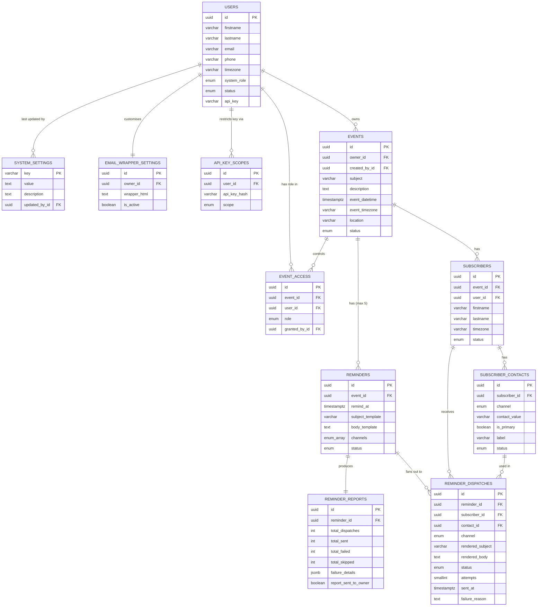

**REMINDER MANAGEMENT SYSTEM**

Functional Specification

Version 1.1

**Status: Final — Ready for Development**

April 2026

*Change from v1.0: Recurring reminder support added (Section 3.2.11, 3.2.12, 3.3, 5.3–5.5)*

# **Table of Contents**

# **1. Purpose & Scope**

## **1.1 Overview**

The Reminder Management System (RMS) is a reminder-centred platform that enables registered users and integrated third-party systems to configure, manage, and dispatch personalised multi-channel reminder notifications for any type of schedulable event.

The system is deliberately reminder-centred rather than event-centred. An event provides context; the reminder is the deliverable. This distinction drives every architectural decision: reminders are first-class entities with their own lifecycle, delivery audit trail, and reporting. The dispatch engine — the component that queries for due reminders and fires them — is the heart of the system.

## **1.2 In Scope — Version 1**

* User account management via API and web UI
* Event and reminder configuration via API and web UI
* Per-event subscriber management via API and web UI
* Per-event role-based access control (owner, contributor, reader)
* Multi-channel delivery: HTML email and SMS, sent simultaneously
* Extensible channel architecture for future delivery channels
* Recurring reminders with configurable frequency: hourly, daily, weekdays, weekends, weekly, fortnightly, monthly, every 3 months, every 6 months, yearly, or never (default)
* Configurable dispatch engine with poll frequency adjustable at runtime without redeployment
* Per-reminder dispatch reports with automated owner notification
* JWT authentication for web UI sessions
* API key authentication for machine-to-machine integrations, with optional scope restrictions
* Public registration with system-admin-controlled enable/disable gate
* Email verification flow for self-registered users
* Custom HTML email wrapper branding per user
* API rate limiting with documented Redis migration path
* Automated event archiving with archived events remaining queryable

## **1.3 Out of Scope — Version 1**

* Custom recurrence rules (e.g. "every 3rd Tuesday") — fixed frequency options only
* Recurrence with a custom end date — recurrence always terminates at event\_datetime
* Mobile push notifications
* Webhook delivery channel
* Self-service subscriber unsubscribe portal
* Billing, usage tiers, or multi-tenant isolation

# **2. Stakeholders, Roles & Permissions**

## **2.1 System-Level Roles**

| **Role** | **Description** | **Assigned by** |
| --- | --- | --- |
| system\_admin | Full platform access. Can manage all users, all events, all settings. Can enable/disable public registration, adjust system settings, and un-archive events. | Seeded at deployment or promoted by another admin |
| user | Standard account. Can create events, manage their own profile, and interact with events they have been granted access to. | Default on registration or admin creation |

## **2.2 Event-Level Access Control**

| **Event Role** | **View event** | **Edit fields** | **Add/edit reminders** | **Delete event** | **Manage subscribers** | **Manage access grants** | **Reassign owner** |
| --- | --- | --- | --- | --- | --- | --- | --- |
| owner | Yes | Yes | Yes | Yes | Yes | Yes | Yes |
| contributor | Yes | Yes | Yes | No | Yes | No | No |
| reader | Yes | No | No | No | No | No | No |

|  |
| --- |
| *The user who creates an event is automatically assigned the owner role. A system\_admin has implicit owner-level access on all events. An event must always have exactly one owner. API key integrations act with owner-level access for events they create.* |

## **2.3 Stakeholder Types**

| **Stakeholder** | **Description** |
| --- | --- |
| System User | A registered, verified account. Creates and manages events via the web UI or API. |
| Event Owner | The system user responsible for a specific event. Defaults to the creator. Can be reassigned. |
| Subscriber | A person to be notified. May or may not be a system user. Defined by name, timezone, and one or more contact details (email/phone). |
| External System | A third-party application integrating via the REST API using an API key. Operates with owner-level permissions for events it creates. |
| System Admin | Platform operator with full access and the ability to configure system-wide settings. |

# **3. Core Entities**

## **3.0 Entity Relationship Diagram**

Renderers that support Mermaid will display the diagram below. If your renderer does not support Mermaid, open the original HTML at [rms_erd_v03.html](rms_erd_v03.html#L1).

## **3.1 Entity Summary**

| **Entity** | **Table** | **Purpose** |
| --- | --- | --- |
| User | users | Registered account holder. Owns events and API keys. |
| Email Verification Token | email\_verification\_tokens | Time-limited token to verify a self-registered user's email address. |
| API Key | api\_keys | Named authentication credential for machine-to-machine access. |
| API Key Scope | api\_key\_scopes | Optional permission restriction applied to an API key. |
| System Setting | system\_settings | Key/value store for platform-wide configuration including dispatch poll interval. |
| Email Wrapper Setting | email\_wrapper\_settings | Per-user custom HTML wrapper applied to outgoing reminder emails. |
| Event | events | The schedulable occurrence providing context for reminders. |
| Event Access | event\_access | Per-user role grant for a specific event. |
| Subscriber | subscribers | A named delivery target scoped to one event. |
| Subscriber Contact | subscriber\_contacts | Individual contact detail (email or phone) for a subscriber. |
| Reminder | reminders | A scheduled notification: when to send, what to say, which channels to use, and how often to repeat. |
| Reminder Dispatch | reminder\_dispatches | Atomic delivery record: one per Reminder x Subscriber x Channel x Occurrence. |
| Reminder Report | reminder\_reports | Aggregated delivery summary produced after all dispatches for a reminder occurrence resolve. |

## **3.2 Entity Details**

### **3.2.1 users**

| **Field** | **Type** | **Constraints / Notes** |
| --- | --- | --- |
| id | UUID | PK, system-generated |
| firstname | varchar(100) | Required |
| lastname | varchar(100) | Required |
| email | varchar(255) | Required, unique, valid format. Indexed. |
| phone | varchar(30) | Optional |
| password\_hash | varchar | Required. bcrypt hash. |
| timezone | varchar(60) | IANA timezone string. Default: UTC. Used as fallback for subscriber timezone resolution and day-of-week recurrence calculations. |
| system\_role | enum | user | system\_admin. Default: user. |
| status | enum | active | disabled | deleted. Soft-delete only. |
| email\_verified | boolean | Default false for self-registered users. Default true for admin-created users. |
| email\_verified\_at | timestamptz | Nullable. Set when verification completes. |
| created\_at | timestamptz | System-set |
| updated\_at | timestamptz | System-set |

**Business rules:**

* Disabling a user invalidates all their active API keys immediately. Their events remain active and reminders continue to fire.
* Deletion is a soft-delete (status = deleted). Hard deletion is not permitted.
* A user being deleted must have their events reassigned before deletion completes.

### **3.2.2 email\_verification\_tokens**

| **Field** | **Type** | **Constraints / Notes** |
| --- | --- | --- |
| id | UUID | PK |
| user\_id | UUID FK | References users.id |
| token\_hash | varchar(128) | SHA-256 hash of the raw token. Unique. |
| expires\_at | timestamptz | created\_at + 24 hours |
| used\_at | timestamptz | Nullable. Set when token is consumed. |
| created\_at | timestamptz | System-set |

### **3.2.3 api\_keys**

| **Field** | **Type** | **Constraints / Notes** |
| --- | --- | --- |
| id | UUID | PK |
| user\_id | UUID FK | References users.id |
| key\_hash | varchar(128) | SHA-256 hash of raw key. Unique. Hot-path lookup index. |
| key\_prefix | varchar(8) | First 8 chars stored plaintext for display. e.g. rms\_a1b2 |
| name | varchar(100) | Required. Human label. |
| status | enum | active | revoked |
| last\_used\_at | timestamptz | Nullable. Updated asynchronously on each authenticated request. |
| expires\_at | timestamptz | Optional. Null = no expiry. |
| created\_at | timestamptz | System-set |
| revoked\_at | timestamptz | Nullable. Set when revoked. |

### **3.2.4 api\_key\_scopes**

| **Field** | **Type** | **Constraints / Notes** |
| --- | --- | --- |
| id | UUID | PK |
| api\_key\_id | UUID FK | References api\_keys.id |
| scope | enum | users:read | events:read | events:write | subscribers:read | subscribers:write | reports:read |
| created\_at | timestamptz | System-set |

### **3.2.5 system\_settings**

| **Key** | **Default** | **Description** |
| --- | --- | --- |
| allow\_public\_registration | false | When false, POST /auth/register returns 403. |
| dispatch\_poll\_interval\_seconds | 60 | How often the dispatch engine polls for due reminders. Min: 10, Max: 3600. Read on every loop iteration — changes are live with no restart. |
| dispatch\_lookahead\_seconds | 65 | Reminders due within this window are picked up each poll. Should be slightly larger than poll interval. |
| dispatch\_retry\_max | 3 | Maximum delivery attempts per dispatch record. |
| dispatch\_retry\_backoff\_minutes | 1,5,15 | Comma-separated backoff intervals in minutes. |
| event\_archive\_days | 90 | Days after event\_datetime before nightly auto-archive. |
| default\_email\_wrapper\_html | (system HTML) | Fallback email wrapper when user has no custom wrapper. |

### **3.2.6 email\_wrapper\_settings**

| **Field** | **Type** | **Constraints / Notes** |
| --- | --- | --- |
| id | UUID | PK |
| owner\_id | UUID FK | References users.id. Unique — one record per user. |
| wrapper\_html | text | Required. Full HTML with exactly one {{body}} injection point. |
| is\_active | boolean | Default true. When false, system default is used. |
| created\_at | timestamptz | System-set |
| updated\_at | timestamptz | System-set |

### **3.2.7 events**

| **Field** | **Type** | **Constraints / Notes** |
| --- | --- | --- |
| id | UUID | PK |
| owner\_id | UUID FK | References users.id. Required. |
| created\_by\_id | UUID FK | References users.id. Immutable. |
| subject | varchar(255) | Required |
| description | text | Optional |
| event\_datetime | timestamptz | Required. UTC. The hard stop for all recurring reminders. |
| event\_timezone | varchar(60) | IANA string. Used for day-of-week recurrence calculations (weekdays/weekends/weekly). |
| location | varchar(500) | Optional |
| status | enum | active | cancelled | archived |
| created\_at | timestamptz | System-set |
| updated\_at | timestamptz | System-set |

**Business rules:**

* Cancelling an event transitions all scheduled and recurring reminders to cancelled.
* event\_datetime acts as the universal termination boundary for all recurring reminders on that event. No reminder occurrence is dispatched at or after event\_datetime.
* event\_timezone is used (not UTC) when computing weekday/weekend/weekly recurrence to ensure day-of-week semantics are correct for the event's local context.

### **3.2.8 event\_access**

| **Field** | **Type** | **Constraints / Notes** |
| --- | --- | --- |
| id | UUID | PK |
| event\_id | UUID FK | References events.id |
| user\_id | UUID FK | References users.id |
| role | enum | owner | contributor | reader |
| granted\_by\_id | UUID FK | References users.id |
| created\_at | timestamptz | System-set |

### **3.2.9 subscribers**

| **Field** | **Type** | **Constraints / Notes** |
| --- | --- | --- |
| id | UUID | PK |
| event\_id | UUID FK | References events.id |
| user\_id | UUID FK | Optional. |
| firstname | varchar(100) | Required |
| lastname | varchar(100) | Required |
| timezone | varchar(60) | Optional. Resolution: subscriber → event owner → UTC. |
| status | enum | active | unsubscribed |
| created\_at | timestamptz | System-set |
| updated\_at | timestamptz | System-set |

### **3.2.10 subscriber\_contacts**

| **Field** | **Type** | **Constraints / Notes** |
| --- | --- | --- |
| id | UUID | PK |
| subscriber\_id | UUID FK | References subscribers.id |
| channel | enum | email | sms. Extensible via new enum value + ChannelAdapter. |
| contact\_value | varchar(320) | Required. Email address or E.164 phone number. |
| is\_primary | boolean | Exactly one primary per channel per subscriber. |
| label | varchar(100) | Optional. e.g. "work email" |
| status | enum | active | inactive |
| created\_at | timestamptz | System-set |

### **3.2.11 reminders**

*This is the primary entity updated in v1.1 to support recurrence.*

| **Field** | **Type** | **Constraints / Notes** |
| --- | --- | --- |
| id | UUID | PK |
| event\_id | UUID FK | References events.id |
| remind\_at | timestamptz | Required. UTC. The first (or only) fire time. Must be before event\_datetime and at least 5 minutes in the future at creation. |
| subject\_template | varchar(500) | Required. Email subject. Supports {{variables}}. |
| body\_template | text | Required. HTML body for email; plain text for SMS. Supports {{variables}}. |
| channels | enum[] | At least one of: email, sms. All channels sent simultaneously per occurrence. |
| recurrence | enum | never | hourly | daily | weekdays | weekends | weekly | fortnightly | monthly | every\_3\_months | every\_6\_months | yearly. Default: never. |
| next\_remind\_at | timestamptz | Nullable. For recurring reminders: the next scheduled fire time. Updated by dispatch engine after each occurrence. Null when recurrence = never or when no further occurrences remain (past event\_datetime). |
| last\_dispatched\_at | timestamptz | Nullable. Timestamp of the most recently dispatched occurrence. |
| occurrence\_count | int | Default 0. Incremented by the engine on each successful dispatch cycle. Used in {{occurrence\_number}} template variable. |
| status | enum | scheduled | processing | recurring | sent | cancelled | failed. See lifecycle below. |
| created\_at | timestamptz | System-set |
| updated\_at | timestamptz | System-set |

**Reminder status lifecycle:**

| **Status** | **Meaning** |
| --- | --- |
| scheduled | Awaiting its first fire. Either recurrence = never (one-shot) or recurring but not yet fired once. |
| processing | Currently being processed by the dispatch engine for the current occurrence. Prevents double-dispatch via SELECT FOR UPDATE SKIP LOCKED. |
| recurring | Has fired at least once and has future occurrences pending (next\_remind\_at is set and is before event\_datetime). |
| sent | All occurrences complete. Either a one-shot reminder that fired, or a recurring reminder whose next computed occurrence would be at or after event\_datetime. |
| cancelled | Cancelled manually or because the parent event was cancelled. No further dispatches. |
| failed | All retry attempts exhausted on a dispatch and no further occurrences are scheduled. |

**Recurrence business rules:**

* recurrence = never is the default. The reminder fires once at remind\_at and transitions to sent.
* For all recurrence values other than never, remind\_at is the first occurrence. next\_remind\_at is calculated and set by the engine after each dispatch.
* No occurrence is ever dispatched at or after event.event\_datetime. The engine checks this before scheduling the next occurrence.
* A reminder with recurrence != never may be edited (recurrence value changed, remind\_at changed) while status = scheduled. Once status = recurring, only cancellation is permitted.
* Maximum 5 reminders per event still applies regardless of recurrence settings.
* When an event is cancelled, all reminders in scheduled or recurring status transition to cancelled.

### **3.2.12 Recurrence Frequency Reference**

| **Recurrence value** | **Interval computed as** | **Day-of-week context** | **Example: remind\_at = Mon 09:00** |
| --- | --- | --- | --- |
| never | No recurrence. One-shot. | N/A | Fires once on Monday 09:00. |
| hourly | Next occurrence = current + 1 hour | N/A | Fires 09:00, 10:00, 11:00... until event\_datetime. |
| daily | Next occurrence = current + 1 day (same time) | N/A | Fires Mon 09:00, Tue 09:00, Wed 09:00... |
| weekdays | Next occurrence = next weekday at same time | Uses event\_timezone | Mon–Fri only. Fri 09:00 → next Mon 09:00. |
| weekends | Next occurrence = next weekend day at same time | Uses event\_timezone | Sat/Sun only. Sun 09:00 → next Sat 09:00. |
| weekly | Next occurrence = current + 7 days (same time) | N/A | Same day each week at same time. |
| fortnightly | Next occurrence = current + 14 days | N/A | Every two weeks. |
| monthly | Next occurrence = current + 1 calendar month | N/A | Mon 1 Apr 09:00 → Thu 1 May 09:00. |
| every\_3\_months | Next occurrence = current + 3 calendar months | N/A | Quarterly. |
| every\_6\_months | Next occurrence = current + 6 calendar months | N/A | Twice yearly. |
| yearly | Next occurrence = current + 1 calendar year | N/A | Same date and time next year. |

|  |
| --- |
| *For monthly, every\_3\_months, every\_6\_months, and yearly: if the computed next date does not exist in the target month (e.g. 31 January + 1 month = 31 February which does not exist), use the last day of the target month instead (28 or 29 February). This is standard calendar arithmetic behaviour.* |

### **3.2.13 Template Variable Reference**

All templates use {{variable\_name}} syntax. Values are substituted per-subscriber at dispatch time.

| **Variable** | **Resolves to** | **Notes** |
| --- | --- | --- |
| {{subscriber\_firstname}} | Subscriber's first name |  |
| {{subscriber\_lastname}} | Subscriber's last name |  |
| {{subscriber\_fullname}} | First + last name |  |
| {{event\_subject}} | Event subject |  |
| {{event\_description}} | Event description | Empty string if not set |
| {{event\_datetime}} | Event date and time | In resolved subscriber timezone |
| {{event\_date}} | Event date only | In resolved subscriber timezone |
| {{event\_time}} | Event time only | In resolved subscriber timezone |
| {{event\_location}} | Event location | "TBD" if not set |
| {{event\_timezone\_label}} | Timezone name and abbreviation | e.g. "Europe/Madrid (CET)". Notes fallback if used. |
| {{owner\_firstname}} | Event owner's first name |  |
| {{owner\_lastname}} | Event owner's last name |  |
| {{owner\_fullname}} | Event owner's full name |  |
| {{reminder\_datetime}} | When this occurrence fires | In resolved subscriber timezone |
| {{occurrence\_number}} | Ordinal of this occurrence | e.g. 1, 2, 3. Always 1 for non-recurring reminders. Useful in messages like "Reminder {{occurrence\_number}} for {{event\_subject}}". |

### **3.2.14 reminder\_dispatches**

| **Field** | **Type** | **Constraints / Notes** |
| --- | --- | --- |
| id | UUID | PK |
| reminder\_id | UUID FK | References reminders.id |
| subscriber\_id | UUID FK | References subscribers.id |
| subscriber\_contact\_id | UUID FK | References subscriber\_contacts.id |
| channel | enum | email | sms |
| occurrence\_number | int | Which occurrence this dispatch belongs to. Matches reminders.occurrence\_count at time of dispatch. |
| rendered\_subject | varchar(500) | Email subject after substitution. Null for SMS. |
| rendered\_body | text | Message body after substitution. |
| status | enum | pending | sent | failed | skipped |
| attempts | smallint | Default 0. Max = dispatch\_retry\_max setting. |
| last\_attempted\_at | timestamptz | Nullable |
| sent\_at | timestamptz | Nullable. Set on success. |
| failure\_reason | text | Nullable. Set on failure. |
| created\_at | timestamptz | System-set |

### **3.2.15 reminder\_reports**

*One report record is created per occurrence (per dispatch cycle), not per reminder. This allows per-occurrence delivery history for recurring reminders.*

| **Field** | **Type** | **Constraints / Notes** |
| --- | --- | --- |
| id | UUID | PK |
| reminder\_id | UUID FK | References reminders.id |
| occurrence\_number | int | Which occurrence this report covers. Unique with reminder\_id. |
| total\_dispatches | int | Total dispatch records created for this occurrence |
| total\_sent | int | Successfully delivered |
| total\_failed | int | Failed after all retries |
| total\_skipped | int | Skipped (no contact, unsubscribed, etc.) |
| failure\_details | jsonb | Array of {subscriber\_id, channel, contact\_value, reason} |
| report\_sent\_to\_owner | boolean | Whether the owner summary email was sent |
| report\_sent\_at | timestamptz | Nullable |
| created\_at | timestamptz | System-set |

## **3.3 Database Indexing Strategy**

| **Table** | **Index name** | **Columns** | **Type** | **Reason** |
| --- | --- | --- | --- | --- |
| users | users\_email\_idx | email | UNIQUE btree | Login lookup |
| users | users\_status\_idx | status | btree | Filter active users |
| api\_keys | api\_keys\_hash\_idx | key\_hash | UNIQUE btree | Hot path: every API request |
| api\_keys | api\_keys\_user\_id\_idx | user\_id | btree | List keys per user |
| events | events\_owner\_id\_idx | owner\_id | btree | List events by owner |
| events | events\_status\_dt\_idx | status, event\_datetime | btree | Archive job; date-range queries |
| event\_access | event\_access\_uq | event\_id, user\_id | UNIQUE btree | Access check per request |
| event\_access | event\_access\_user\_idx | user\_id | btree | Events accessible by user |
| subscribers | sub\_event\_id\_idx | event\_id | btree | List subscribers for event |
| subscribers | sub\_event\_status\_idx | event\_id, status | btree | Last-subscriber guard |
| subscriber\_contacts | sc\_subscriber\_idx | subscriber\_id | btree | Load contacts for subscriber |
| subscriber\_contacts | sc\_primary\_idx | subscriber\_id, channel, is\_primary | btree | Fan-out: primary contact per channel |
| reminders | rem\_event\_id\_idx | event\_id | btree | List reminders for event |
| reminders | rem\_scheduler\_idx | status, remind\_at | btree | HOT PATH: first-fire scheduler poll (status = scheduled) |
| reminders | rem\_recurring\_idx | status, next\_remind\_at | btree | HOT PATH: recurring scheduler poll (status = recurring) |
| reminder\_dispatches | rd\_reminder\_occ\_idx | reminder\_id, occurrence\_number | btree | Load dispatches for one occurrence |
| reminder\_dispatches | rd\_retry\_idx | status, attempts, last\_attempted\_at | btree | Retry worker query |
| reminder\_dispatches | rd\_pending\_idx | reminder\_id, occurrence\_number, status | btree | All-resolved check for report trigger |
| reminder\_dispatches | rd\_sent\_at\_idx | sent\_at | btree | Archive/cleanup queries |
| reminder\_reports | rr\_reminder\_occ\_uq | reminder\_id, occurrence\_number | UNIQUE btree | One report per occurrence per reminder |
| email\_wrapper\_settings | ews\_owner\_uq | owner\_id | UNIQUE btree | One wrapper per user |

# **4. API Specification**

## **4.1 Overview**

All endpoints are prefixed /api/v1. JSON-only. All datetimes ISO 8601 with UTC offset.

## **4.2 Authentication**

| **Mode** | **Header** | **Use case** | **Expiry** |
| --- | --- | --- | --- |
| JWT | Authorization: Bearer <token> | Web UI sessions. Issued on login. | 24 hours. Refreshable. |
| API Key | X-Api-Key: <key> | Machine-to-machine. External integrations. | Optional. None by default. |

## **4.3 Rate Limiting**

| **Tier** | **Window** | **Limit** | **Applied to** |
| --- | --- | --- | --- |
| Unauthenticated | 15 min | 100 requests | IP address |
| Authenticated user | 1 min | 300 requests | user.id |
| Authenticated API key | 1 min | 600 requests | API key |
| system\_admin | 1 min | 1000 requests | user.id |
| Auth endpoints (/auth/\*) | 15 min | 20 attempts | IP — brute-force protection |
| Resend verification | 1 hour | 3 per email | Email address |

Response headers: X-RateLimit-Limit, X-RateLimit-Remaining, X-RateLimit-Reset. Exceeded: 429 with Retry-After.

*v1: express-rate-limit with in-memory store. Upgrade path: replace store with rate-limit-redis. No logic changes.*

## **4.4 Standard Response Envelope**

{ "success": true, "data": { ... }, "meta": { "page": 1, "per\_page": 20, "total": 150 }, "error": null }

## **4.5 Endpoint Reference**

### **4.5.1 Authentication**

| **Method** | **Path** | **Access** | **Description** |
| --- | --- | --- | --- |
| **POST** | /auth/register | Public (gated) | Self-registration. 403 if registration disabled. |
| **GET** | /auth/verify-email?token=... | Public | Consume email verification token. |
| **POST** | /auth/resend-verification | Public (rate limited) | Resend verification email. |
| **POST** | /auth/login | Public | Exchange credentials for JWT. |
| **POST** | /auth/refresh | Authenticated | Refresh JWT |
| **POST** | /auth/logout | Authenticated | Invalidate JWT |

### **4.5.2 Users**

| **Method** | **Path** | **Access** | **Description** |
| --- | --- | --- | --- |
| **POST** | /users | system\_admin | Create user (admin). Pre-verified. |
| **GET** | /users/:id | Self / admin | Get user profile |
| **PATCH** | /users/:id | Self / admin | Update name, email, phone, timezone |
| **POST** | /users/:id/disable | system\_admin | Disable. Revokes all active API keys. |
| **POST** | /users/:id/enable | system\_admin | Re-enable user |
| **DELETE** | /users/:id | system\_admin | Soft-delete |
| **GET** | /users/:id/email-wrapper | Self / admin | Get wrapper settings |
| **PUT** | /users/:id/email-wrapper | Self | Create or replace custom wrapper |
| **PATCH** | /users/:id/email-wrapper | Self | Update wrapper fields |
| **DELETE** | /users/:id/email-wrapper | Self | Remove custom wrapper. Reverts to system default. |

### **4.5.3 API Keys**

| **Method** | **Path** | **Access** | **Description** |
| --- | --- | --- | --- |
| **POST** | /users/:id/api-keys | Self | Create key. Raw key returned once only. |
| **GET** | /users/:id/api-keys | Self | List keys (prefix + metadata, never raw key). |
| **PATCH** | /users/:id/api-keys/:kid | Self | Update name or expiry |
| **POST** | /users/:id/api-keys/:kid/revoke | Self / admin | Revoke key immediately |
| **GET** | /users/:id/api-keys/:kid/scopes | Self | List scopes for key |
| **PUT** | /users/:id/api-keys/:kid/scopes | Self | Replace scope list. [] = unrestricted. |

### **4.5.4 Events**

| **Method** | **Path** | **Access** | **Description** |
| --- | --- | --- | --- |
| **POST** | /events | Any authenticated | Create event. |
| **GET** | /events | Any authenticated | List events. Filters: status, date range. Default excludes archived. |
| **GET** | /events/:id | reader+ | Full event detail |
| **PATCH** | /events/:id | contributor+ | Update subject, description, datetime, location |
| **PATCH** | /events/:id/owner | owner only | Reassign event owner |
| **POST** | /events/:id/cancel | owner only | Cancel event and all scheduled/recurring reminders. |
| **POST** | /events/:id/unarchive | system\_admin | Restore archived event |
| **DELETE** | /events/:id | owner only | Delete. Blocked if dispatch records exist. |
| **GET** | /events/:id/access | owner only | List access grants |
| **POST** | /events/:id/access | owner only | Grant role to user |
| **PATCH** | /events/:id/access/:uid | owner only | Change user role |
| **DELETE** | /events/:id/access/:uid | owner only | Revoke access |

### **4.5.5 Reminders**

| **Method** | **Path** | **Access** | **Description** |
| --- | --- | --- | --- |
| **POST** | /events/:id/reminders | contributor+ | Add reminder. Max 5 per event. Templates and recurrence validated on create. |
| **GET** | /events/:id/reminders | reader+ | List reminders. Includes recurrence and occurrence\_count. |
| **GET** | /events/:id/reminders/:rid | reader+ | Get reminder detail |
| **PATCH** | /events/:id/reminders/:rid | contributor+ | Update. Blocked if status is recurring, sent, or cancelled. Full edit allowed while status = scheduled. |
| **DELETE** | /events/:id/reminders/:rid | owner only | Delete or cancel. Blocked if dispatch records exist. |
| **POST** | /events/:id/reminders/:rid/preview | contributor+ | Render preview for a specific occurrence number (default: next occurrence). Uses real subscriber data if available. |
| **GET** | /events/:id/reminders/:rid/report | reader+ | List all occurrence reports for this reminder. |
| **GET** | /events/:id/reminders/:rid/report/:occ | reader+ | Get report for a specific occurrence number. |

### **4.5.6 Subscribers**

| **Method** | **Path** | **Access** | **Description** |
| --- | --- | --- | --- |
| **POST** | /events/:id/subscribers | contributor+ | Add subscriber |
| **GET** | /events/:id/subscribers | reader+ | List subscribers |
| **GET** | /events/:id/subscribers/:sid | reader+ | Get subscriber detail |
| **PATCH** | /events/:id/subscribers/:sid | contributor+ | Update subscriber |
| **DELETE** | /events/:id/subscribers/:sid | contributor+ | Remove. Blocked if last active subscriber. |
| **POST** | /events/:id/subscribers/:sid/unsubscribe | contributor+ | Soft unsubscribe |
| **POST** | /events/:id/subscribers/:sid/contacts | contributor+ | Add contact |
| **PATCH** | /events/:id/subscribers/:sid/contacts/:cid | contributor+ | Update contact |
| **DELETE** | /events/:id/subscribers/:sid/contacts/:cid | contributor+ | Remove. Blocked if last active contact. |

### **4.5.7 Admin**

| **Method** | **Path** | **Access** | **Description** |
| --- | --- | --- | --- |
| **GET** | /admin/settings | system\_admin | List all system settings |
| **PATCH** | /admin/settings/:key | system\_admin | Update setting. Validated against min/max where applicable. |
| **GET** | /admin/users | system\_admin | List all users with search and filter |

# **5. Dispatch Engine**

## **5.1 Overview**

The dispatch engine is a separate Python process from the API server. It is the heart of the system. Running it separately ensures that heavy dispatch bursts do not affect API response times.

## **5.2 Configurable Poll Frequency**

The engine reads dispatch\_poll\_interval\_seconds from system\_settings at the start of every loop iteration. Changes made via PATCH /admin/settings/dispatch\_poll\_interval\_seconds take effect within one cycle — no restart, no redeployment. Minimum: 10 seconds. Maximum: 3600 seconds. On database read failure, the engine falls back to the last known interval.

## **5.3 Scheduler Loop**

On each iteration the engine:

* Reads dispatch\_poll\_interval\_seconds and dispatch\_lookahead\_seconds from system\_settings
* Executes a combined query for both first-fire and recurring reminders:

SELECT \* FROM reminders

WHERE (

(status = 'scheduled' AND remind\_at <= NOW() + interval '{lookahead}s')

OR

(status = 'recurring' AND next\_remind\_at <= NOW() + interval '{lookahead}s')

)

AND event\_id IN (SELECT id FROM events WHERE status = 'active')

FOR UPDATE SKIP LOCKED

* Immediately updates matched reminders to status = 'processing' in the same transaction
* Passes matched reminders to the fan-out worker
* Sleeps for poll\_interval\_seconds, then repeats

## **5.4 Fan-out**

For each processing reminder:

* Increment occurrence\_count on the reminder record
* Load all active subscribers for the parent event
* For each subscriber x channel: resolve timezone, render templates (substituting {{occurrence\_number}} with the current occurrence\_count), create reminder\_dispatch record
* Pass pending dispatch records to delivery workers

## **5.5 Recurrence: Next Occurrence Calculation**

After all dispatches for the current occurrence have been created and delivery is underway, the engine computes the next occurrence:

* If recurrence = never: transition reminder to sent. No further action.
* Compute candidate\_next using the recurrence rule (see Section 3.2.12) applied to the current occurrence time. For weekdays/weekends/weekly, use event.event\_timezone for day-of-week arithmetic.
* If candidate\_next >= event.event\_datetime: transition reminder to sent, set next\_remind\_at = null. Recurrence is complete.
* If candidate\_next < event.event\_datetime: transition reminder to recurring, set next\_remind\_at = candidate\_next, set last\_dispatched\_at = NOW().

|  |
| --- |
| *The check is candidate\_next >= event\_datetime, not just >. A reminder should not fire at the exact moment of the event. This is a strict boundary: the event\_datetime is the cutoff, inclusive.* |

## **5.6 Delivery**

| **Channel** | **Provider** | **Content** | **Notes** |
| --- | --- | --- | --- |
| email | SendGrid (or AWS SES) | HTML. rendered\_subject as subject. rendered\_body in owner's wrapper. | Plain-text fallback auto-generated by stripping HTML. |
| sms | Twilio | Plain text. HTML stripped from rendered\_body. | subject\_template not used for SMS. |

*Adding a new channel: implement ChannelAdapter interface with send(dispatch\_record) -> result. No other changes.*

## **5.7 Retry Logic**

* On failure: increment attempts on dispatch record
* If attempts < dispatch\_retry\_max: schedule retry with backoff from dispatch\_retry\_backoff\_minutes
* If attempts == dispatch\_retry\_max: set dispatch status to failed, record failure\_reason

## **5.8 Report Generation**

Once all dispatch records for an occurrence are in a terminal state (sent, failed, skipped):

* Create a reminder\_report record for this occurrence\_number with counts and failure\_details JSON
* For recurring reminders: the report covers this occurrence only. A new report is generated for each subsequent occurrence.
* Send HTML summary email to event owner
* For non-recurring reminders (recurrence = never): transition reminder to sent after report is generated
* For recurring reminders: the reminder status is already set to recurring or sent by the next-occurrence calculation (step 5.5). Report generation is independent of that transition.

## **5.9 Nightly Maintenance Jobs**

* Archive job (02:00 UTC): events where status = active AND event\_datetime < NOW() - {event\_archive\_days} days.
* Key expiry job (02:00 UTC): api\_keys where status = active AND expires\_at < NOW().

# **6. Web UI**

## **6.1 Overview**

Single-page application served from the same droplet. Communicates exclusively with the REST API. No server-side rendering.

## **6.2 Technology Stack**

| **Layer** | **Choice** | **Rationale** |
| --- | --- | --- |
| Framework | React 18 (Vite) | Industry standard SPA. |
| Server state | TanStack Query | Caching, loading states, refetching, optimistic updates. |
| UI components | shadcn/ui | Accessible, composable. |
| Styling | Tailwind CSS | Pairs with shadcn. |
| Forms | React Hook Form + Zod | Mirrors server-side validation. |
| Rich text editor | TipTap | HTML reminder body template editor. |
| Auth storage | httpOnly cookie | JWT not accessible via JavaScript. |

## **6.3 Pages and Features**

### **Authentication**

* Login, register, verify email, resend verification

### **User account**

* Profile edit: name, email, phone, timezone
* Change password
* API key management: create, list, revoke, set scopes and expiry
* Email branding: custom wrapper editor with live preview

### **Events dashboard**

* List of accessible events with status, role badge, and quick actions
* Filter by status and date range

### **Event detail and edit**

* View and edit event fields (scoped by role)
* Reminders tab: list reminders with status, recurrence badge, and occurrence count. Add, edit, cancel.
* Subscribers tab: list, add, edit, remove
* Access tab (owner only): manage grants
* Reports tab: per-occurrence delivery counts and failure summaries for each reminder

### **Reminder editor — recurrence additions**

* remind\_at datetime picker (first occurrence)
* Recurrence selector: dropdown with all 11 options. Default: Never. When a recurrence option other than Never is selected, a read-only computed preview shows the first 3 scheduled occurrences and the final occurrence before event\_datetime.
* Channel toggles: email / SMS
* Subject template with variable helper (includes {{occurrence\_number}})
* HTML body editor with variable helper
* Live preview panel showing rendered output for a chosen occurrence number

### **Subscriber editor**

* Firstname, lastname, timezone picker (fallback note if left blank)
* Contact list with primary flag management

### **Admin panel (system\_admin only)**

* User management: list, search, enable/disable/delete
* System settings editor including dispatch\_poll\_interval\_seconds with live-change note
* Cross-user event list

# **7. Technology Stack**

| **Layer** | **Choice** | **Version** | **Rationale** |
| --- | --- | --- | --- |
| API server | Node.js + Express | 20 LTS / 5.x | Existing competency. Excellent REST ecosystem. |
| ORM (API) | Prisma | 5.x | Type-safe, schema-first. Migrations built in. |
| Dispatch engine | Python + APScheduler | 3.12 / 4.x | Better suited for long-running worker processes. |
| ORM (engine) | SQLAlchemy | 2.x | Consistent with Python competency. |
| Database | PostgreSQL | 16 | Row-level locking for scheduler, JSONB, UUID types, excellent archiving. |
| Email delivery | SendGrid | HTTP API v3 | Reliable deliverability. 100 free emails/day. |
| SMS delivery | Twilio | REST API | Industry standard. Pay-as-you-go. |
| Web UI | React + Vite | 18 / 5.x | Standard SPA stack. |
| Auth | jsonwebtoken + bcrypt | Latest | JWT sessions, bcrypt password hashing. |
| Rate limiting | express-rate-limit | 7.x | In-memory store v1. Redis drop-in for scaling. |
| Process manager | PM2 + Supervisor | Latest | PM2 for Node API, Supervisor for Python engine. |
| Reverse proxy | Nginx | Latest stable | /api → Express. / → React static build. |
| SSL | Let's Encrypt / Certbot | Latest | Free automated SSL. |
| CI/CD | GitHub Actions | N/A | Deploy on push to main. |

# **8. Infrastructure**

## **8.1 Version 1 — Single Droplet**

| **Component** | **Spec** | **Notes** |
| --- | --- | --- |
| DigitalOcean Droplet | $12/month — 2 vCPU, 2GB RAM, 50GB SSD | Handles stated scale comfortably. |
| PostgreSQL | Local on droplet | Upgradeable to DO Managed Database ($15/month). |
| Nginx | Local, port 80/443 | Reverse proxy and static file server. |
| Express API server | PM2, port 3000 | API process. |
| Python dispatch engine | Supervisor | Separate worker process. |
| React build | Static files via Nginx | Built by GitHub Actions, deployed via rsync. |
| SSL | Let's Encrypt | Auto-renewed by Certbot. |

**Droplet layout:**

DigitalOcean Droplet ($12/month)

Nginx (ports 80/443, SSL via Let's Encrypt)

/api → Express API server (port 3000, PM2)

/ → React static build

Python dispatch engine (Supervisor, continuous loop)

PostgreSQL 16 (local)

## **8.2 CI/CD Pipeline**

Triggered on push to main:

* Run test suite
* Build React static files
* SSH to droplet: git pull, npm ci, pip install, prisma migrate deploy
* Reload PM2 and Supervisor processes
* Copy React build to Nginx web root

## **8.3 Upgrade Path**

| **Trigger** | **Action** | **Effort** |
| --- | --- | --- |
| API latency increases | Migrate PostgreSQL to DO Managed DB. Scale API horizontally behind DO Load Balancer. | Low |
| Rate limiting across multiple instances | Replace in-memory store with rate-limit-redis. | Low |
| Dispatch engine falls behind | Run multiple dispatch engine instances. SKIP LOCKED handles coordination. | Very low |
| reminder\_dispatches table performance | PostgreSQL range partitioning by sent\_at month. | Medium |

# **9. Scale Considerations**

## **9.1 Design Targets**

| **Metric** | **Target** | **Notes** |
| --- | --- | --- |
| Total events | 100,000 | Active + archived combined |
| Subscribers per event | Up to 5,000 | Worst-case fan-out per reminder occurrence |
| Reminders per event | Up to 5 | Hard limit |
| Recurring occurrences | Unbounded within event lifetime | Bounded by event\_datetime and recurrence frequency |
| Dispatch records (lifetime) | Up to 500M+ | Mitigated by archiving and partitioning |
| Concurrent API users | ~200 | Comfortable on stated droplet spec |

## **9.2 Recurring Reminder Volume**

Recurrence introduces significantly more dispatch records than v1.0. A daily reminder on an event 365 days away with 100 subscribers generates 36,500 dispatches from a single reminder. Operators should be aware of this when configuring high-frequency recurrence on events with large subscriber lists. The rem\_recurring\_idx index on (status, next\_remind\_at) ensures the scheduler query remains fast regardless of total reminder count.

## **9.3 Scheduler Efficiency**

Two indexes serve the scheduler hot path: rem\_scheduler\_idx on (status, remind\_at) for first-fire reminders, and rem\_recurring\_idx on (status, next\_remind\_at) for recurring ones. At any given poll cycle, the working set of due reminders is small. The combined query is an index scan on a narrow status/time slice.

## **9.4 Data Volume and Archiving**

* reminder\_dispatches is the largest table. The occurrence\_number column allows efficient per-occurrence queries without full table scans.
* Dispatch records older than 180 days are archived monthly to a dispatch\_archive table.
* PostgreSQL range partitioning by sent\_at month applied when table exceeds ~50M rows.
* reminder\_reports grow proportionally to occurrences. One report per occurrence keeps report size bounded and the failure\_details JSONB compact.

## **9.5 Delivery Rate Limits**

The system bottleneck at scale is SendGrid and Twilio rate limits, not RMS compute or database. A reminder with 5,000 subscribers and 2 channels generates 10,000 outbound messages per occurrence. For high-frequency recurrence at large subscriber counts, operators should confirm their provider plan supports the expected throughput. RMS retry logic handles transient provider rate-limit errors gracefully.

## **9.6 What Changes When Scaling Up**

| **Scenario** | **What changes** | **What stays the same** |
| --- | --- | --- |
| Multiple API instances | Rate limit store migrated to Redis. | All business logic, API contracts, schema. |
| Multiple dispatch instances | Nothing. SKIP LOCKED coordinates safely. | Everything. |
| New delivery channel | New enum value + ChannelAdapter class. | All existing entities, scheduler, reports. |
| Higher recurrence volume | Add rem\_recurring\_idx if not already present. Consider partitioning. | Recurrence logic, fan-out, report generation. |
| Recurring events (future v2) | New fields on events + scheduler generates child reminder instances. | Core dispatch engine unchanged. |

# **Appendix A: Registration Flow**

* Check allow\_public\_registration. If false → 403 REGISTRATION\_DISABLED.
* Validate fields. Check email uniqueness.
* Create user: status = active, email\_verified = false, system\_role = user.
* Generate token. Store SHA-256 hash. 24h expiry. Send verification email.
* Respond 201 with instruction to verify email.

Verification: hash token, look up, mark used, set email\_verified = true, respond 200.

Unverified login → 403 EMAIL\_NOT\_VERIFIED.

# **Appendix B: API Key Auth Flow**

* Hash X-Api-Key header (SHA-256). Look up in api\_keys.
* Not found or revoked → 401. Expired → 401 API\_KEY\_EXPIRED. User disabled → 401.
* Load scopes. Check required scope for route. Missing → 403 INSUFFICIENT\_SCOPE.
* Update last\_used\_at asynchronously. Attach user + scopes to request context.

# **Appendix C: Timezone Resolution**

* subscriber.timezone set → use it.
* Else use event owner's timezone. Append "[owner's timezone]" to {{event\_timezone\_label}}.
* Else UTC. Append "[UTC fallback]".

*For day-of-week recurrence (weekdays, weekends, weekly): always use event.event\_timezone, not subscriber timezone, so the recurrence pattern is consistent for all subscribers regardless of their location.*

# **Appendix D: Recurrence Calculation Examples**

Examples using remind\_at = Wednesday 15 March 2026 at 09:00 UTC, event\_datetime = Friday 30 October 2026 at 09:00 UTC, event\_timezone = Europe/London (GMT, no DST in March).

| **Recurrence** | **1st occurrence** | **2nd occurrence** | **3rd occurrence** | **Terminates when** |
| --- | --- | --- | --- | --- |
| never | 15 Mar 09:00 | (none) | (none) | After 1st fire |
| daily | 15 Mar 09:00 | 16 Mar 09:00 | 17 Mar 09:00 | Next = 31 Oct ≥ 30 Oct |
| weekdays | 15 Mar 09:00 (Wed) | 16 Mar 09:00 (Thu) | 17 Mar 09:00 (Fri) | Next = Mon 2 Nov ≥ 30 Oct |
| weekly | 15 Mar 09:00 | 22 Mar 09:00 | 29 Mar 09:00 | Next = 1 Nov ≥ 30 Oct |
| monthly | 15 Mar 09:00 | 15 Apr 09:00 | 15 May 09:00 | Next = 15 Nov ≥ 30 Oct |
| yearly | 15 Mar 09:00 | 15 Mar 2027 | (none) | 2027 > 2026 event\_datetime |

# **Appendix E: Recommended Next Artefacts**

* OpenAPI 3.1 specification — from Section 4 endpoint tables. Generates Postman collections and client SDKs.
* Database DDL (migration files) — CREATE TABLE + indexes for all 13 tables. First repository commit.
* Project scaffold — monorepo: apps/api (Node/Express), apps/worker (Python), apps/web (React), packages/db (Prisma).
* Environment variable specification — database URL, SendGrid key, Twilio credentials, JWT secret, domain, etc.

**END OF SPECIFICATION**

*Reminder Management System — Functional Specification v1.1*

**Ready for Development**